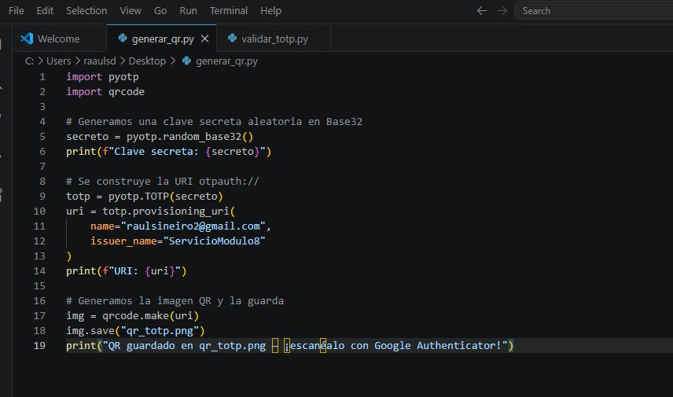
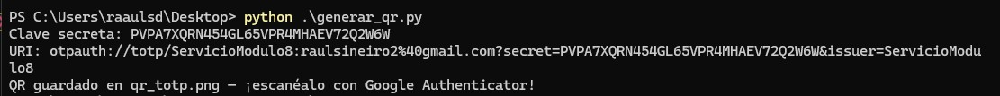
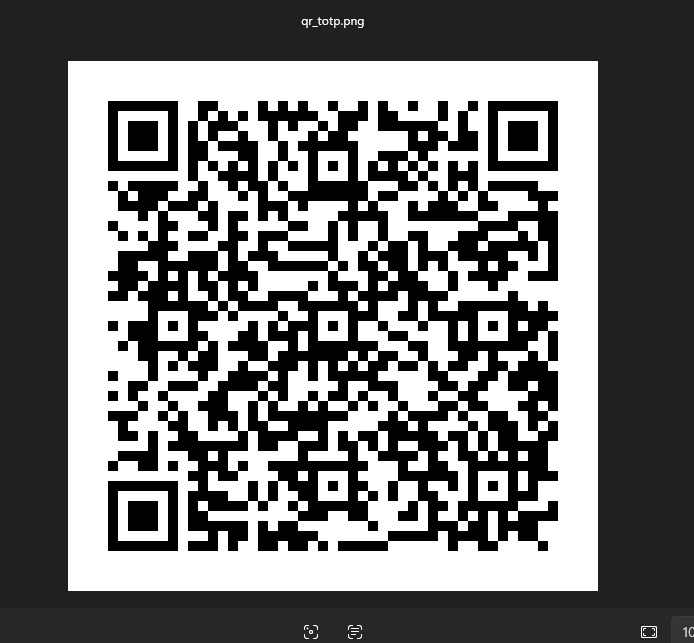
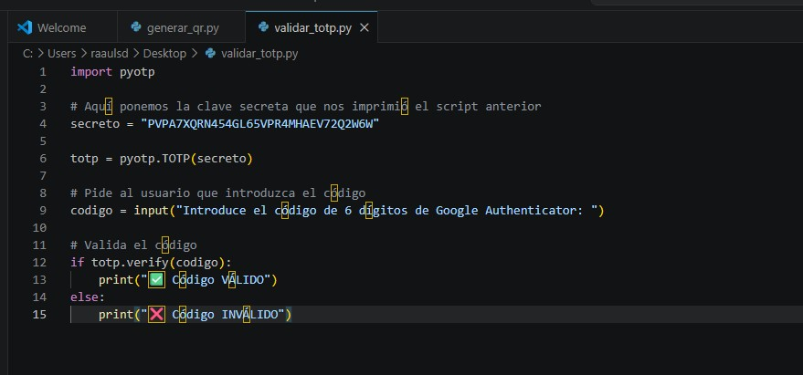
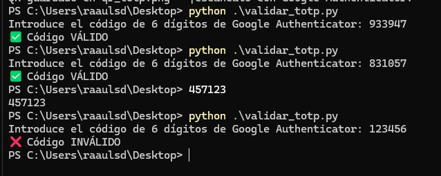

# 🔐 TOTP Authenticator

Utilidad en Python para generar y validar contraseñas de un solo uso basadas en tiempo (**TOTP**),
compatible con Google Authenticator y cualquier aplicación que cumpla el estándar RFC 6238.

## ¿Cómo funciona TOTP?

TOTP genera un código de 6 dígitos a partir de una clave secreta compartida y el tiempo actual,
renovándose cada 30 segundos mediante HMAC-SHA1. Esto lo hace resistente a ataques de repetición
y adecuado para implementar autenticación de dos factores (2FA).

## Requisitos

```bash
pip install pyotp qrcode[pil]
```

## Pasos seguidos

### 1. Generar la clave secreta y el código QR

`generar_qr.py` genera una clave secreta aleatoria en Base32, construye la URI `otpauth://`
que entienden las apps de autenticación y la convierte en un código QR listo para escanear.



Al ejecutarlo se crea el fichero `qr_totp.png` y se imprime la clave secreta por consola:



### 2. Escanear el QR con Google Authenticator

Con Google Authenticator instalado en el móvil, se pulsa **`+`** → "Escanear código QR"
y se apunta la cámara al `qr_totp.png` generado en el paso anterior.




Una vez escaneado con la app de nuestro móvil, la app empieza a mostrar códigos de 6 dígitos renovados cada 30 segundos.

### 3. Validar el código TOTP

`validar_totp.py` pide al usuario que introduzca el código que muestra Google Authenticator
y lo compara con el código esperado calculado a partir de la clave secreta y el tiempo actual.
Indica si el código es válido o inválido.



Como podemos ver en la siguiente imágen, al introducir los códigos que nos da la app (los dos primeros) nos los valida, pero si introducimos un código incorrecto nos da error:



Con esto ya tendríamos un validador TOTP completamente funcional, capaz de integrarse
como base en cualquier sistema que requiera autenticación de dos factores.
